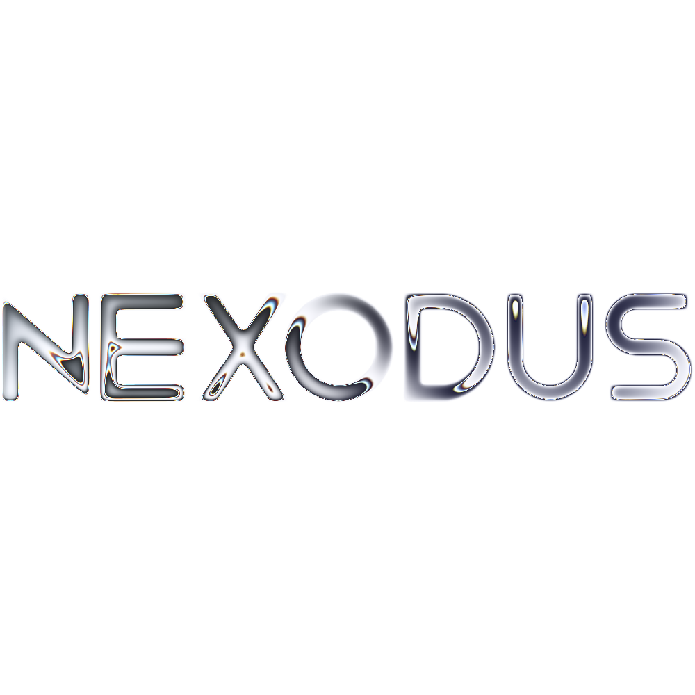

Nexodus is a React and Next.js-powered AI chat application that leverages the Mistral AI API. This project is front-end oriented and focuses on providing a seamless chatting experience with features like chat history and Markdown processing.

## Features

- **Chatting**: Real-time conversation with AI.
- **History**: View and manage chat history(not completely implemented yet).
- **Markdown Processing**: Support for Markdown formatting in chat messages.
- **Code highlighting**: Detects and highlights almost any programming language syntax.

## Technologies

- **React**: A JavaScript library for building user interfaces.
- **TypeScript**: A typed superset of JavaScript that compiles to plain JavaScript.
- **Next.js**: A React framework for building server-side rendered and statically exported applications.
- **Mistral API**: AI-powered chat functionality.

## Installation

1. **Clone the repository**:
```bash
git clone https://github.com/Res-NeoTech/nexodus.git
cd nexodus
```
2. **Install dependencies**:
```bash
npm install
```
3. **Run the project in development mode**:
```bash
npm run dev
```
4. **Build the project for production**:
```bash
npm run build
```
5. **Usage**
To use Nexodus, simply run the development server using npm run dev and open your browser to http://localhost:3000. You can start chatting with the AI and explore the features like chat history and Markdown processing.

## Contributing
Contributions are welcome! Please follow these steps to contribute:

Fork the repository.
Create a new branch (git checkout -b feature/your-feature).
Make your changes and commit them (git commit -am 'Add your feature').
Push to the branch (git push origin feature/your-feature).
Create a new Pull Request.
License
This project is licensed under the MIT License. See the LICENSE file for more details.

## Contact
For any questions or suggestions, please contact me at [my website](https://maksym.ch/contact).

## Demo
Check out the live demo of Nexodus: https://nexodus.maksym.ch